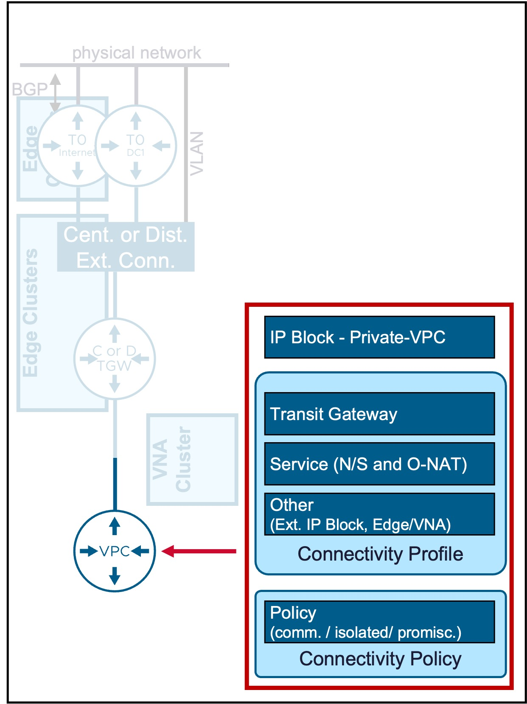

<h1>
   VPC Gateway Configuration in vCenter
</h1>

This section describes the procedures for configuring a VPC Gateway using the vSphere Client.
  
**VPC Gateway** is the logical router for VPC networking.

{ width="100%" }

---

## VPC Gateway

### Configuration

#### Step1. Create new VPC Gateway
{ width="80%" style="display: block; margin: 0 auto;" }

#### Step2. Configure new VPC Gateway
{ width="50%" style="display: block; margin: 0 auto;" }

* **Private - VPC IP CIDRs**  
  (Optional) Defines the IP address space reserved for internal VPC subnets.  
  Address selection here is highly flexible; since all traffic from Private VPC subnets is **Source NATed (SNATed)** using a Public/External IP before exiting the VPC, these internal addresses can not conflict with your existing physical network infrastructure.

* **Connectivity Profile**  
  Select the pre-defined [Connectivity Profile](3e-connectivity_profile.md).  
  This profile links the VPC to:  
  . [Transit Gateway](3b-transit_gateway.md) - determines the primary North-South path to the physical network  
  . [External IP Blocks](3c-ip_block.md) and [Private -TGW IP Blocks](3c-ip_block.md) - determines the future IP addressing of the VPC subnets / NAT / LB  
  . [Default Outbound SNAT](1c-vpc_nat.md) - determines if compute (VMs / VKS) connected to Private VPC subnets will be SNATed by default to access external networks  
  Note: The Network Span (which vCenter Cluster(s) can access this VPC) is configured at the Transit Gateway level.

* **Connectivity Policy**  
  Select the [Connectivity Policy](3f-connectivity_policy.md) to govern East/West traffic.  
  This determines whether communication is permitted or denied between this VPC and other VPC subnets within the environment.

### Monitoring
#### Topology
You can see the VPC Gateway in a graphical way under Topology:
{ width="90%" style="display: block; margin: 0 auto;" }

---
