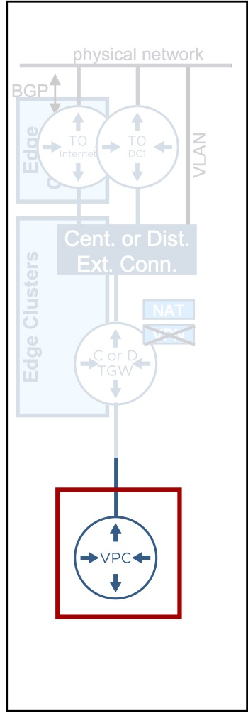
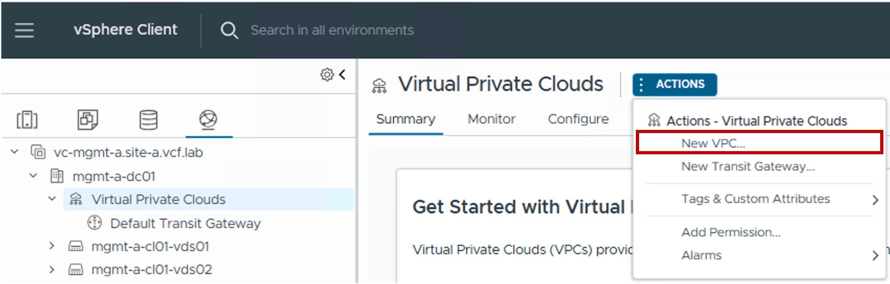

<h1>
   VPC Gateway Configuration in vCenter
</h1>

This section describes the procedures for configuring a VPC Gateway using the vSphere Client.

{ width="100%" }

---

## VPC Gateway

### Configuration

#### Step1. Create new VPC Gateway
{ width="80%" style="display: block; margin: 0 auto;" }

#### Step2. Choose the VPC Gateway name (+ IP Block + North connectivity + Cross-VPC communication)
{ width="50%" style="display: block; margin: 0 auto;" }

* **Private - VPC IP CIDRs**:  
  (Optional) Defines the IP address space reserved for internal VPC subnets.  
  Address selection here is highly flexible; since all traffic from Private VPC subnets is **Source NATed (SNATed)** using a Public/External IP before exiting the VPC, these internal addresses can not conflict with your existing physical network infrastructure.

* **Connectivity Profile**  
  Select the pre-defined [Connectivity Profile](3e-connectivity_profile.md), which links this VPC to a specific [Transit Gateway](3b-transit_gateway.md) and defines its [Network Span](3d-network_span.md).  
  This determines the primary North/South path to the physical network.

* **Connectivity Policy**  
  Select the [Connectivity Policy](3f-connectivity_policy.md) to govern East/West traffic.  
  This determines whether communication is permitted or denied between this VPC and other VPC subnets within the environment.

### Monitoring
#### Topology
You can see the VPC Gateway in a graphical way under Topology:
{ width="90%" style="display: block; margin: 0 auto;" }

---
