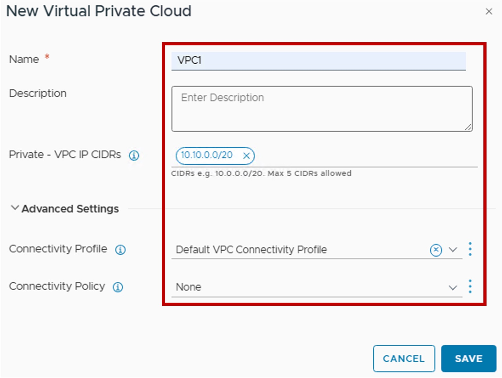

<h1>
   VPC Router
</h1>

This section describes the procedures for configuring a VPC Router using the vSphere Client.

{ width="100%" }

---

## Configuration

### 1. Create new VPC Router
{ width="80%" style="display: block; margin: 0 auto;" }

### 2. Choose the VPC Router name (+ IP Block + North connectivity + Cross-VPC communication)
{ width="50%" style="display: block; margin: 0 auto;" }

* **Private - VPC IP CIDRs**:  
  (Optional) IP Block reserved for future VPC  Private-VPC subnets.  
  The IP Block is flexible because VMs connected to Private VPC subnets are always **NATed** with a public IP when accessing external networks.
* **Connectivity Profile**  
  Select the Connectivity Profile (the profile containing the Transit Gateway + Span).  
  This defines how the VPC connects to the physical network.

* **Connectivity Policy**  
  Select the Connectivity Policy (rules governing cross-VPC communication).  
  This determines whether communication with other VPC subnets is allowed or denied.

### Result - Topology
You can see the VPC-Router in a graphical way under Topology:
{ width="90%" style="display: block; margin: 0 auto;" }

---
