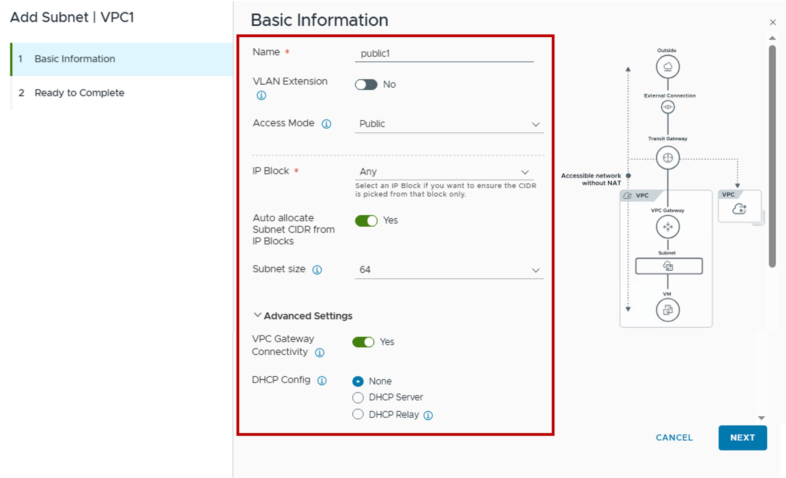
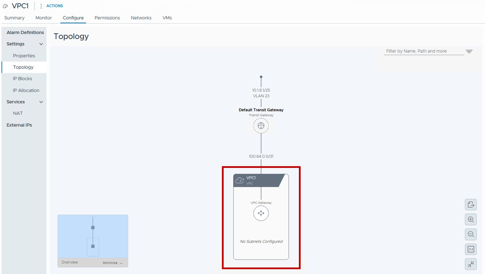

<h1>
   VPC Subnet
</h1>

This section describes the procedures for configuring a VPC Subnet using the vSphere Client.

{ width="100%" }

---

## Configuration VPC Subnet Overlay

### 1. Create new VPC Subnet (Overlay)
{ width="70%" style="display: block; margin: 0 auto;" }

### 2. Choose the VPC Subnet name (+ VLAN option + Subnet mode + IP Block & Size + Connectivity + DHCP)
{ width="90%" style="display: block; margin: 0 auto;" }

* **VLAN Extensions**:  
  Disabled for the VPC-Subnet Overlay.
* **Access Mode**  
  Select VPC Subnet mode based (Public / Private TGW / Private VPC) on the VM access you need.
  { style="width:80%; display:block; margin:0 auto;" }

[{ style="width:80%; display:block; margin:0 auto;" }](images/1b-2-Create_VPC_Subnet_AccessMode.jpg)

* **Connectivity Policy**  
  Select the Connectivity Policy (Policy for cross-VPC communication).
  That's to allow/deny communication to other VPC subnets.

### Result - Topology
{ width="90%" style="display: block; margin: 0 auto;" }

## Configuration VPC Subnet VLAN-Extension

[{ style="width:80%; display:block; margin:0 auto;" }](images/1b-2-Create_VPC_Subnet_AccessMode.jpg)

---
