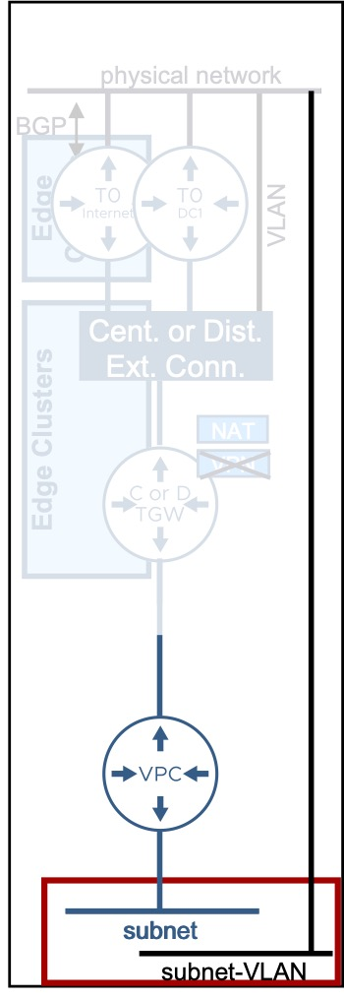
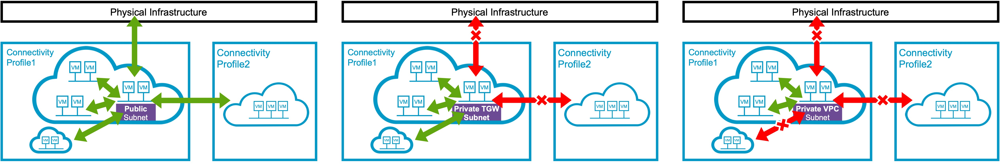
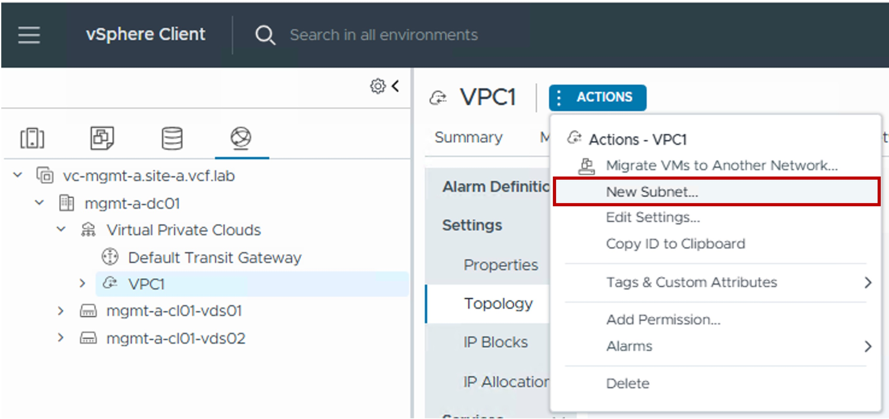
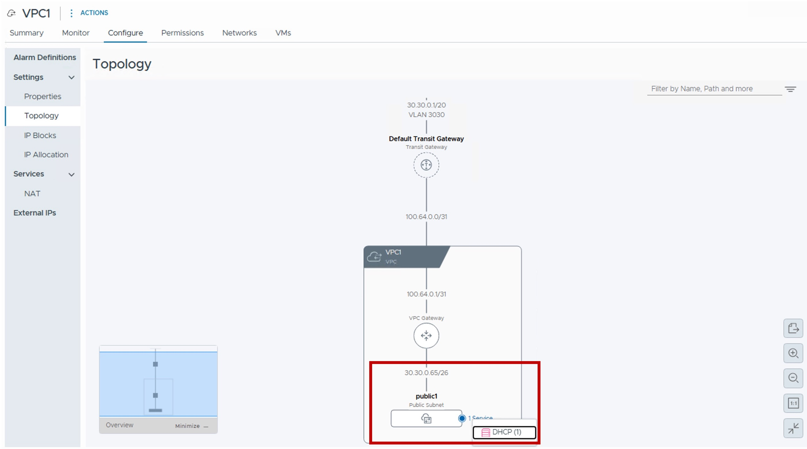
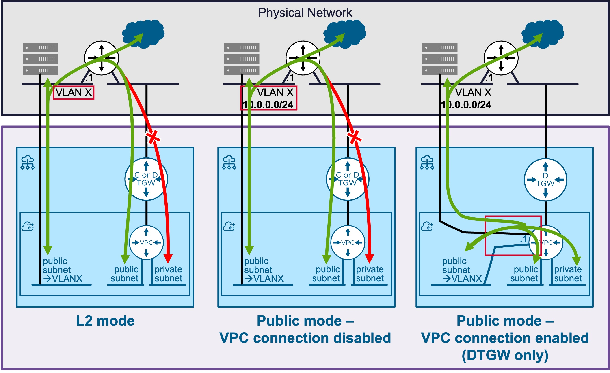
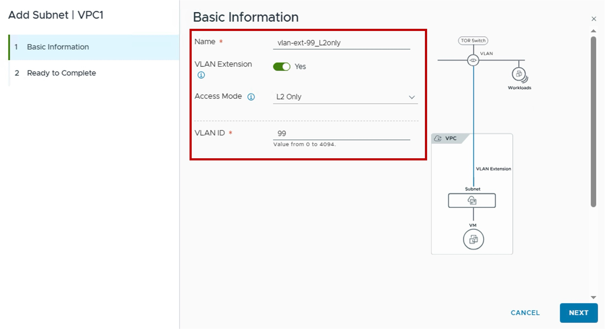
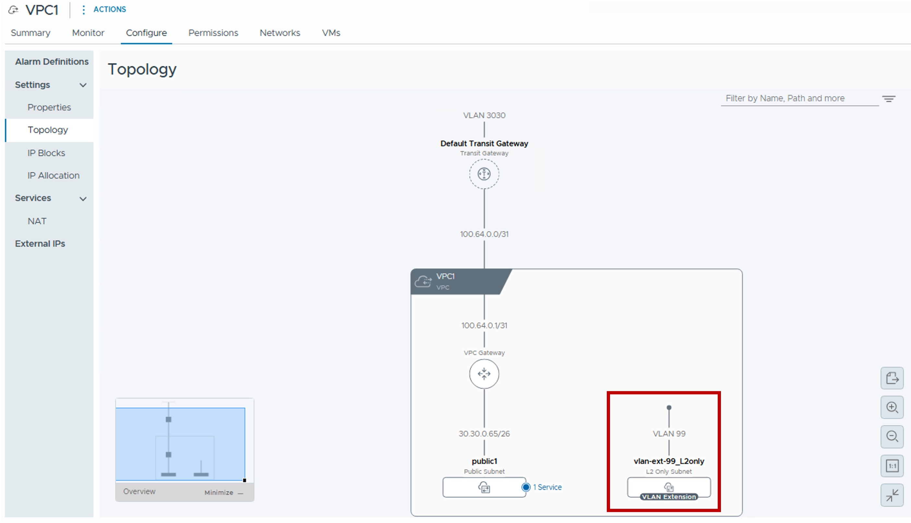

<h1>
   VPC Subnet Configuration in vCenter
</h1>

This section describes the procedures for configuring a VPC Subnet using the vSphere Client.

There are 2 types of VPC Subnets:  

* Overlay
* VLAN

{ width="100%" }

---

## VPC Subnet Overlay

### Overview of Overlay options

| Type | Use Case | Routing Logic |
| :--- | :--- | :--- |
| **Public** | Provide Public IPs to workloads with direct access to the physical network (No-NAT). | External visibility is high; direct ingress/egress. |
| **Private-TGW** | Provide Private IPs to workloads with no access to the physical network (requires NAT), but routably accessible to other VPCs. | Best for shared internal services across the enterprise. |
| **Private-VPC** | Provide Private IPs to workloads with no access to the physical network and other VPCs (requires NAT). | Maximum isolation; workloads are "hidden" even from other VPCs. |

{: .center style="width:95%" }

### Configuration

#### Step1. Create new VPC Subnet (Overlay)
{ width="70%" style="display: block; margin: 0 auto;" }

#### Step2. Choose the VPC Subnet name (+ VLAN option + Subnet mode + IP Block & Size + Connectivity + DHCP)
{ width="90%" style="display: block; margin: 0 auto;" }

* **VLAN Extensions**  
  "No" for a VPC-Subnet Overlay.  
  Note: VLAN Extension is detailed in a the section below.

* **Access Mode**  
  Select VPC Subnet mode based (Public / Private TGW / Private VPC) based on the VM connectivity you need.

* **IP Block**  
  Choose "Any", or select a specific IP Block for that VPC Subnet.

* **Auto allocate Subnet CIDR from IP Blocks**  
  . "Yes" to let VCF Networking choose the VPC Subnet CIDR,  
  . "No" to choose manually the CIDR to use (you can see the "Available Ranges" when clicking on "View IPs..." - not showed in the screenshot).

* **Subnet size**  
  Choose the number of IPs you'll need in that subnet to connect your workloads.  
  Keep in mind, 3 IP will be consumed by the VPC Gateway (subnet IP, default gateway, broadcast IP) + optionally a 4th IP if you enable DHCP Server.

* **VPC Gateway Connectivity**  
  . "Yes": The VPC Subnet will be connected to the VPC Gateway and so workloads connected on that VPC Subnet will have access to outside of that VPC Subnet.  
  . "No": The VPC Subnet will NOT be connected to the VPC Gateway and so workloads connected on that VPC Subnet will NOT have access outside of that VPC Subnet.  

* **DHCP Config**  
  . "None": No DHCP Service.  
  . "DHCP Server": VPC Subnet will have a DHCP Server to offer DHCP service to the workloads connected to that VPC Subnet.  
  .  "DHCP Relay": VPC Gateway will forward DHCP requests for workloads connected to that VPC Subnet to an external DHCP Server.This option is not available if the VPC Gateway is connected to a Distributed Transit Gateway.

### Monitoring
#### Topology
{ width="90%" style="display: block; margin: 0 auto;" }

---

## VPC Subnet VLAN-Extension

### Overview of VLAN options

| Type | Use Case | Routing Logic |
| :--- | :--- | :--- |
| **L2-Only** | Provides direct access to a physical VLAN. | Access to Public VPC Subnets is via the external network only. No access to Private VPC Subnets. |
| **Public - No VPC Connectivity** | The VPC Gateway is aware of the VLAN subnet, but provides no routing services to it. | Not recommended in vCenter (only VCF-A). |
| **Public - VPC Connectivity** | Provides access to the physical VLAN via the VPC Gateway (bridges). | Enables simultaneous access to the Physical VLAN and internal Overlay VPC Subnets. |

{: .center style="width:80%" }

### Configuration

#### Step1. Create new VPC Subnet VLAN-Extension
{ width="70%" style="display: block; margin: 0 auto;" }

#### Step2. Choose the VPC Subnet name + VLAN Extension + Access Mode + VLAN ID (+ Gateway IP + Connectivity))
{ width="70%" style="display: block; margin: 0 auto;" }

* **VLAN Extensions**  
  "Yes" for a VPC-Subnet VLAN-Extension.  

* **Access Mode**  
  Select Access Mode (L2-Only* / Public - No VPC Connectivity / Public - VPC Connectivity) based on the VM connectivity you need.

* **VLAN ID**  
  Enter the physical VLAN ID.

* **Gateway CIDR IPv4 Address** (only for the Access Mode Public)  
  Enter the default gateway of that VLAN (configured in the physical network).

* **VPC Gateway Connectivity** (only for the Access Mode Public)  
  . "No": The VPC Subnet VLAN-Extension will NOT be connected to the VPC Gateway, but directly to the physical VLAN.    
  . "Yes": The VPC Subnet VLAN-Extention will be connected to the VPC Gateway and bridged to the physical VLAN.  

### Monitoring 
#### Topology
{ width="90%" style="display: block; margin: 0 auto;" }

---
