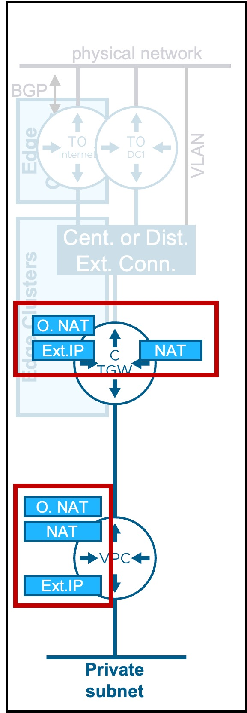
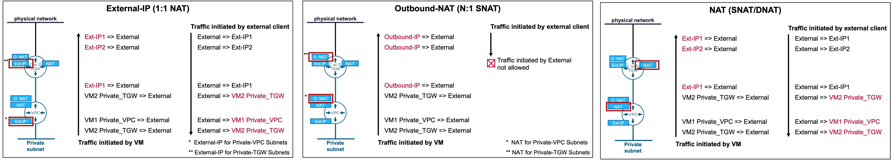
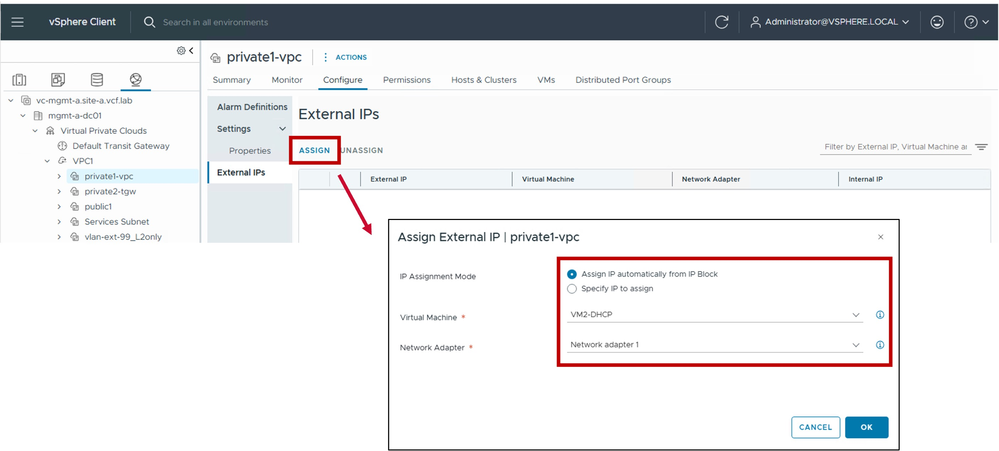
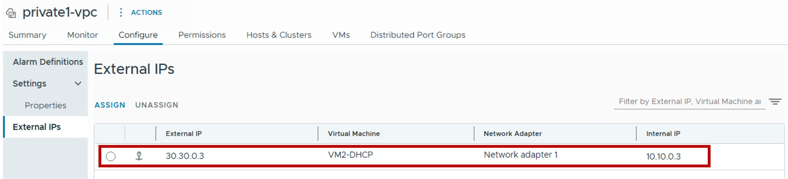
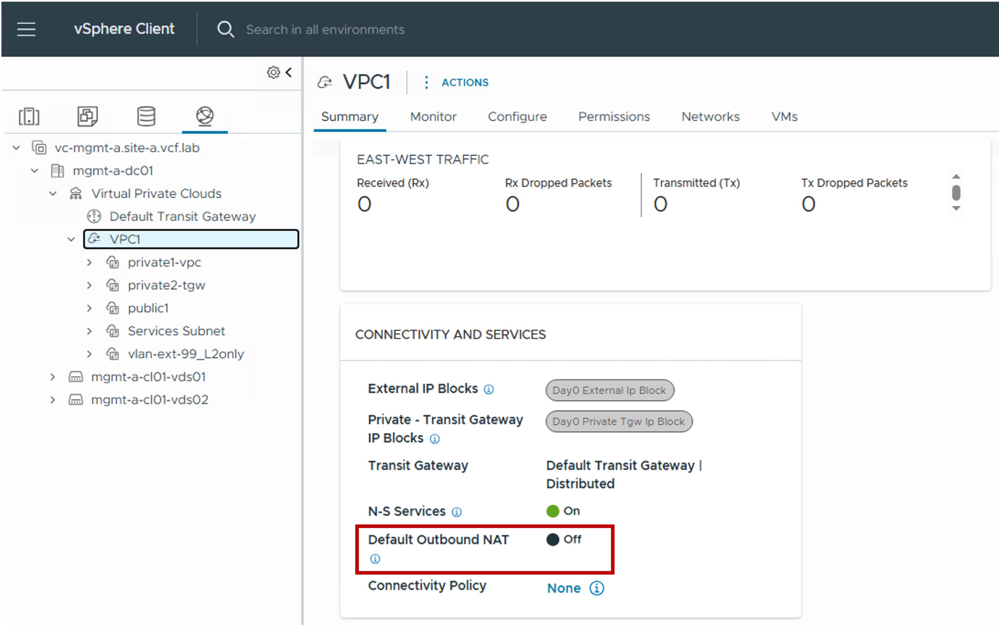
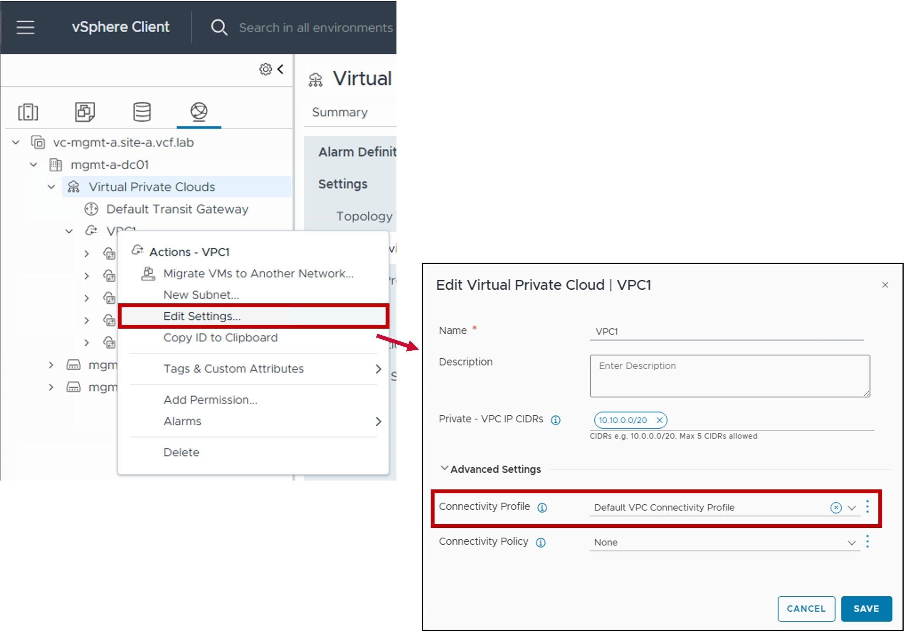
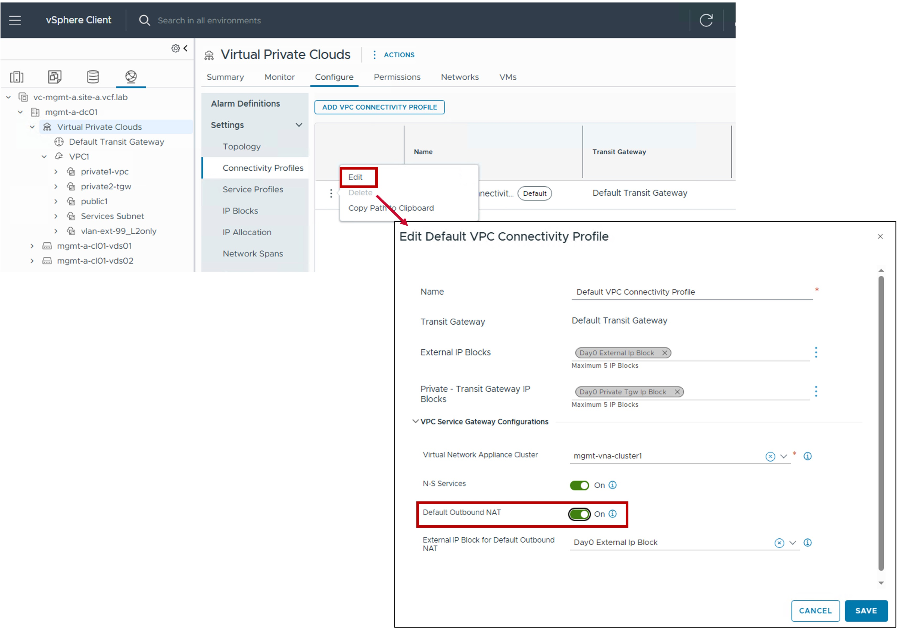
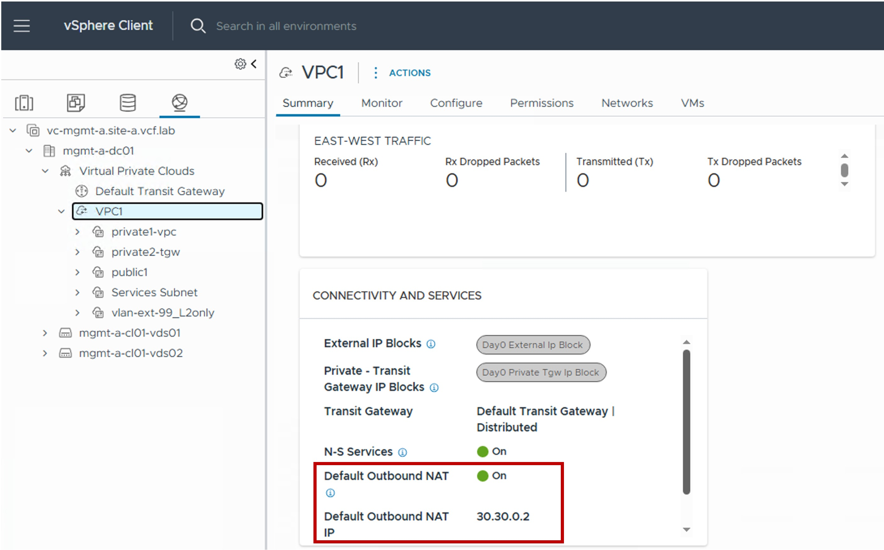

<h1>
   VPC NAT Configuration in vCenter
</h1>

This section describes the procedures for configuring Network Address Translation (NAT) for your VPC workloads in private subnets.  
NAT allows **VPC Private subnets** to communicate with external networks or provides a way for external users to reach private VPC workloads.

{ width="100%" }

---

## Overview of NAT Types

| Type | Use Case | Routing Logic |
| :--- | :--- | :--- |
| [**External-IP (1:1)**](#ext-ip) | Maps a single Public IP to a single Private IP for specific workloads. | Provides Bi-directional communication (Inbound/Outbound) for Private VPC and TGW workloads. |
| [**Outbound-NAT (N:1 SNAT)**](#outbound-nat)| Allows multiple workloads to share a single Public IP for external access. | Supports outbound requests only; hides internal IP addresses from the physical network. |
| [**NAT (SNAT/DNAT)**](#full-nat) | Provides stateful Layer 4 translation for granular traffic control. | Enables flexible port-level translation and mapping between Private subnets and external networks. |

{: .center style="width:90%" }

---

## Configuration External-IP (1:1 NAT) {: #ext-ip }

### 1. Create a new External IP
{ width="70%" style="display: block; margin: 0 auto;" }

### 2. Result - Show the External IP
{ width="90%" style="display: block; margin: 0 auto;" }

---

## Configuration Outbound-NAT (N:1 SNAT) {: #outbound-nat }

!!! warning "Limitation"
    Outbound-NAT is **not supported** on VPCs connected to Distributed Transit Gateways without VNA.  
    (only supported on VPCs connected to Centralized Transit Gateways or Distributed Transit Gateways with VNA)

### 1. Check Outbound-NAT configuration in the VPC Gateway
{ width="70%" style="display: block; margin: 0 auto;" }

### 2. If disabled, Edit the VPC to find the Conenctivity Profile used by the VPC
{ width="70%" style="display: block; margin: 0 auto;" }

### 3. Edit the Conenctivity Profile and enable Outbound-NAT
{ width="90%" style="display: block; margin: 0 auto;" }

### 4. Result - Show the Outbound-NAT IP used by the VPC
{ width="80%" style="display: block; margin: 0 auto;" }

---

## Configuration NAT (SNAT/DNAT) {: #full-nat }

To do...

---

