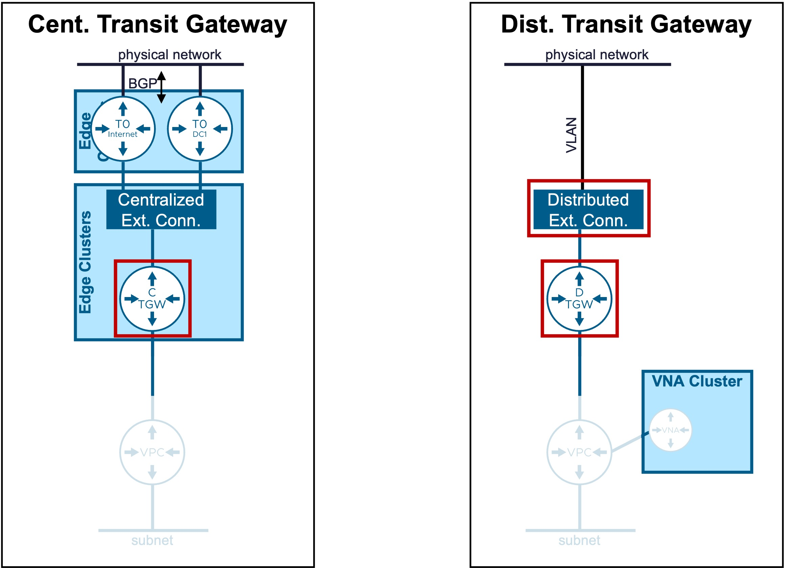
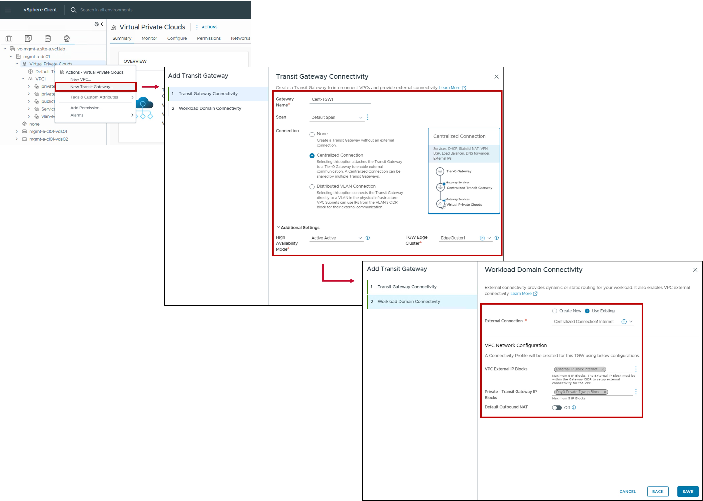
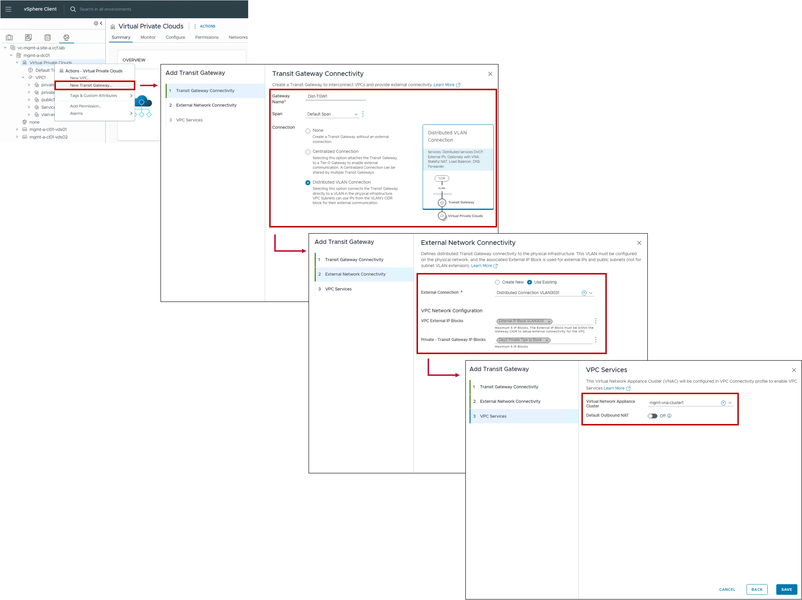

<h1>
   Transit Gateway Configuration in vCenter
</h1>

This section describes the procedures for configuring Transit Gateways using the vSphere Client.  

Transit Gateways (Centralized or Distributed) provide the routing between VPC Gateways and physical networks.

{ width="100%" }

---

## Overview of Transit Gateway Types

| Type | Use Case | Routing Logic |
| :--- | :--- | :--- |
| [**Centralized TGW**](#cent-tgw) | Supports extra stateful services (VPN). | Egress traffic is hairpinned through a centralized Tier-0/VRF gateway hosted on an Edge Cluster. |
| [**Distributed TGW**](#dist-tgw)| Optimized for high-throughput distributed routing (supports Outbound-NAT and LB via VNA Nodes).. | Routing occurs locally at the ESXi host level (distributed dataplane). NAT and LB traffic is redirected through a VNA Gateway in a VNA Cluster. |

{: .center style="width:60%" }

---

## Configuration Centralized Transit Gateway {: #cent-tgw }

### 1. Create new Centralized Transit Gateway 
{ width="80%" style="display: block; margin: 0 auto;" }

* **Tier-0 Gateway**:  
  Select the pre-provisioned Tier-0 Gateway that serves as the exit point for this connection.

* **Remote Networks**:  
  Specifies the remote networks reachable via this connection.  
  Leaving this blank is equivalent to 0.0.0.0/0: routing all external/Internet traffic through this path.

* **External IP Blocks**:  
 Select the External IP Block(s) permitted to be advertised to the physical network via the selected Tier-0.

* **Private IP Blocks**:  
  Enables the advertisement of TGW Private IP Blocks via the Tier-0 for the Centralized Transit Gateway also enabling this.  
  This option is typically used for connectivity to remote data centers/private MPLS rather than the public Internet.  
  By default it is disabled so only External IP Blkocks are advertised.

* **Provider Outbound SNAT**:  
  Enables communication for VPC subnets using External IP Blocks other than those explicitly listed in the "External IP Blocks" field.  
  Traffic from these subnets will be Source NATed (SNAT) using an IP from the SNAT IP Block defined below.

* **SNAT IP Block**:  
  Select the specific External IP Block to be used for the Provider Outbound SNAT.

### 2. Result - Centralized External Connection Status
The status reflects the successful application of the configuration.

!!! info "Note"
    Because this represents a logical configuration mapping rather than an active link-state protocol, the status will typically remain Green (Healthy) once the settings are validated by the NSX Manager.

---

## Configuration Distributed Transit Gateway  {: #dist-tgw }

{ width="80%" style="display: block; margin: 0 auto;" }

* **VLAN ID**:  
  Specifies the VLAN ID used for the Layer 2 handoff to the physical network.

* **Gateway CIDR IPv4 Address**:  
  Specifies the IP address of the upstream physical router or firewall (the Next Hop) that acts as the default gateway for this connection.

### 2. Result - Centralized External Connection Status
The status reflects the successful application of the configuration.

!!! info "Note"
    Because this represents a logical configuration mapping rather than an active link-state protocol, the status will typically remain Green (Healthy) once the settings are validated by the NSX Manager.

---
