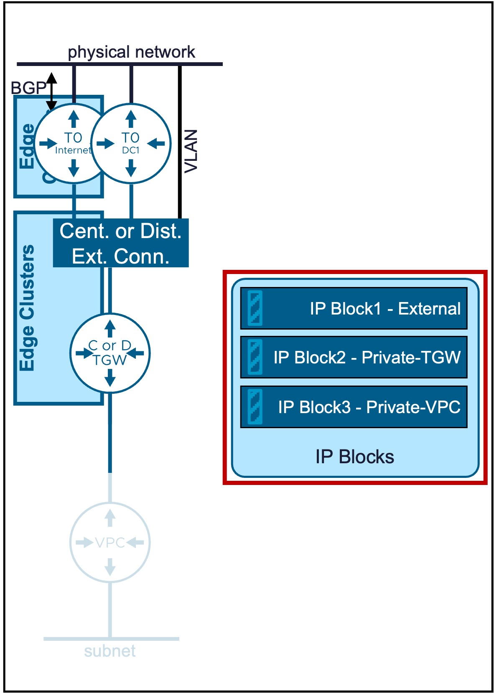
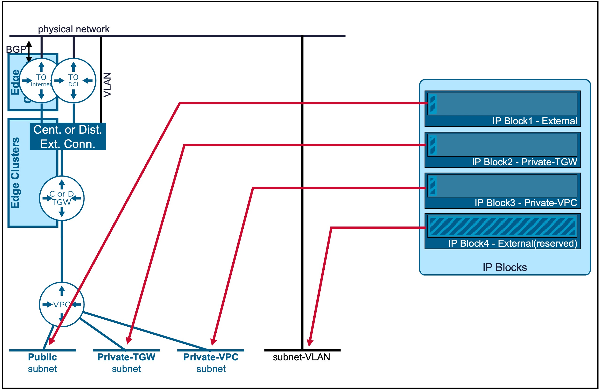
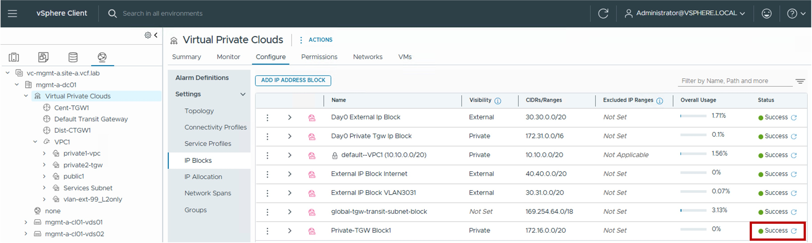
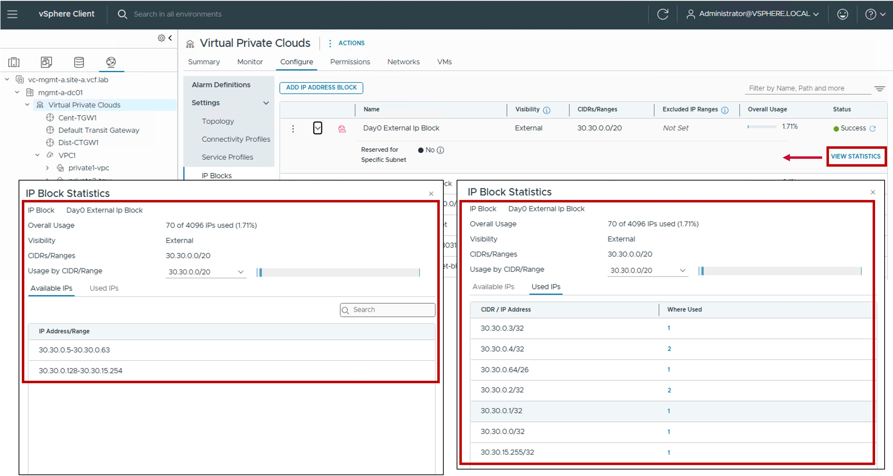

<h1>
   IP Blocks in vCenter
</h1>

This section describes the procedures for configuring IP Blocks using the vSphere Client.  

{ width="100%" }

---

## Overview of IP Block Types

| Type | Use Case | Routing Logic |
| :--- | :--- | :--- |
| [**External**](#ext-ipblock) | Used for **VPC Subnets Public**. | External visibility is high; direct ingress/egress. |
| [**Private-TGW**](#privatetgw-ipblock)| Used for **VPC Subnets Private-TGW** | Best for shared internal services across the enterprise. |
| [**Private-VPC**](#privatevpc-ipblock)| **VPC Subnets Private-VPC**.   Note: Configuration in within the [VPC Gateway](1a-vpc_gateway.md). | Maximum isolation; workloads are "hidden" even from other VPCs. |

{: .center style="width:70%" }

For more information on VPC Subnets, refer to the [VPC Subnet](1b-vpc_subnet.md) page.

---

## 1. Configuration IP Block External {: #ext-ipblock }

This is the IP Block used for future VPC Subnets Public.

### 1. Create new IP Block External
{ width="100%" style="display: block; margin: 0 auto;" }

* **Visibility**:  
  Set to External.

* **CIDRs/Ranges**:  
  Enter the specific CIDR blocks or IP ranges to be managed by this block.
  
* **Excluded IP Ranges**:  
  (Optional) Specify any IP Range(s) within the CIDRs above that should be withheld from automatic allocation (e.g. IP Range used by the physical network).
  
* **Reserved for Specific Subnet**:  
  Enable for the Subnet-VLAN use case, otherwise disabled.

### 2. Result -IP Block External Status
The status reflects the successful application of the configuration.

!!! info "Note"
    Because this represents a logical configuration mapping rather than an active link-state protocol, the status will typically remain Green (Healthy) once the settings are validated by the NSX Manager.

{ width="80%" style="display: block; margin: 0 auto;" }

---

## 2. Configuration IP Block Private-TGW {: #privatetgw-ipblock }

This is the IP Block used for future VPC Subnets Private-TGW.

### 1. Create new IP Block Private-TGW
{ width="100%" style="display: block; margin: 0 auto;" }

* **Visibility**:  
  Set to Private.

* **CIDRs/Ranges**:  
  Enter the specific CIDR blocks or IP ranges to be managed by this block.
  
* **Excluded IP Ranges**:  
  (Optional) Specify any IP Range(s) within the CIDRs above that should be withheld from automatic allocation (e.g. IP Range used by the physical network).
  
* **Reserved for Specific Subnet**:  
  Not Applicable.

### 2. Result -IP Block Private-TGW Status
The status reflects the successful application of the configuration.

!!! info "Note"
    Because this represents a logical configuration mapping rather than an active link-state protocol, the status will typically remain Green (Healthy) once the settings are validated by the NSX Manager.

{ width="80%" style="display: block; margin: 0 auto;" }

---

## 3. Configuration IP Block Private-VPC {: #privatevpc-ipblock }

This is the IP Block used for future VPC Subnets Private-VPC.  
It's configuration is managed directly within the [VPC Gateway](1a-vpc_gateway.md) settings.

---

## 4. Statistics IP Blocks

Real-time utilization metrics for IP Blocks can be monitored via the following indicators:

* **Available IPs**: The remaining number of addresses in the pool ready for allocation.

* **Used IPs**: The number of addresses currently assigned to active VPC subnets. For External IP Blocks, this also includes addresses consumed by NAT and Load Balancer Virtual VIPs.

{ width="95%" style="display: block; margin: 0 auto;" }

---
