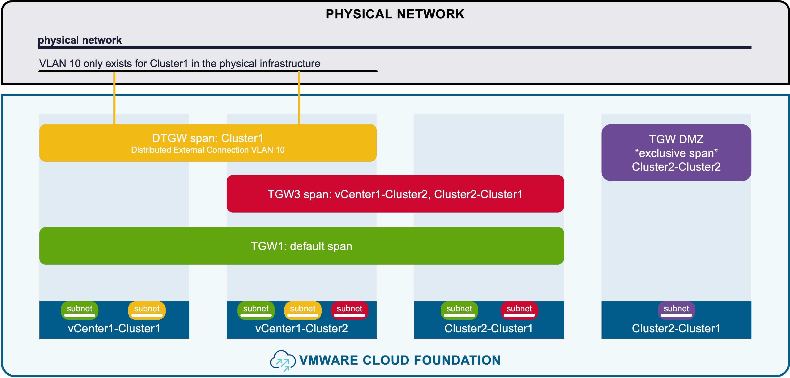

<h1>
   Network Span in vCenter
</h1>

This section describes the procedures for configuring Network Span using the vSphere Client.  

{ width="100%" }

---

## Network Span

### Configuration

#### Step1. Create Network Span

### Monitoring

---
