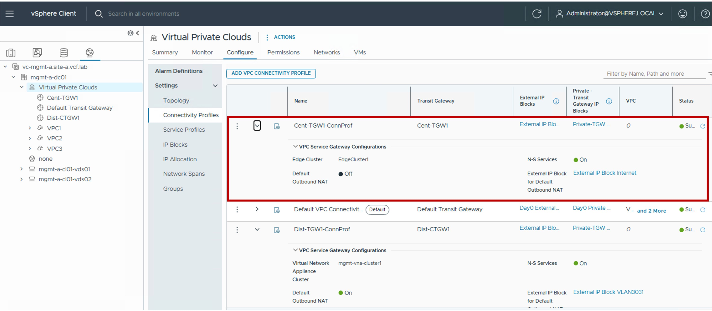
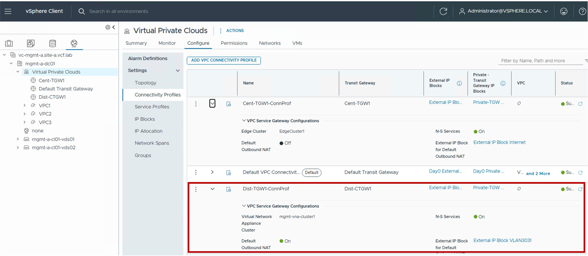

<h1>
   Connectivity Profile in vCenter
</h1>

This section describes the procedures for configuring  Connectivity Profile using the vSphere Client.  

{ width="100%" }

---

## Overview of Connectivity Profile Types

Connectivity Profile defines the VPC's connection to the Transit Gateway, specifies the assigned External and Private-TGW IP blocks, and determines which VPC Services can be enabled.

| Type | Use Case | Routing Logic |
| :--- | :--- | :--- |
| [**Centralized Conn Prof**](#cent-conn) | Connectivity Profile for Centralized Transit Gateways. | VPC Gateways route traffic through a Centralized Transit Gateway. |
| [**Distributed Conn Prof**](#dist-conn)| Connectivity Profile for Distributed Transit Gateways. | VPC Gateways route traffic through a Distributed Transit Gateway. |

{: .center style="width:75%" }

Defines the VPC's connection to the Transit Gateway, specifies the assigned External and Private-TGW IP blocks, and determines which VPC Services are enabled.

---

## Centralized Connectivity Profile {: #cent-conn }

### Configuration

#### Step1. Create Connectivity Profile
{ width="100%" style="display: block; margin: 0 auto;" }

* **Transit Gateway**:  
  Select the Centralized Transit Gateway, VPC Gateways will be connected to.

* **External IP Blocks**:  
  Select the External IP Block(s) VPC Subnets Public and NAT will use.
  
* **Edge Cluster**:  
  (Optional) Select the Edge Cluster to use for the VPC Gateway.  
  Required if N-S Services and/or Default Outbound NAT is enabled in this VPC Connectivity Profile.
  
* **N-S Services**:  
  Enable to allow [NAT](1c-vpc_nat.md#full-nat) on VPC Gateways.

* **Default Outbound NAT**:  
  Enable to allow [Default Outbound NAT](1c-vpc_nat.md#outbound-nat) on VPC Gateways.  
  Note: If the Centralized Transit Gateway selected is Active/Active, then Default Outbound NAT can not be enabled.

* **External IP Block for Default Outbound NAT**:  
  Select the External IP Block to use for VPC Gateways which enabled Outbound NAT.

### Monitoring

#### Status
The status reflects the successful application of the configuration.

!!! info "Note"
    Because this represents a logical configuration mapping rather than an active link-state protocol, the status will typically remain Green (Healthy) once the settings are validated by the NSX Manager.

{ width="80%" style="display: block; margin: 0 auto;" }

---

## Distributed Connectivity Profile {: #dist-conn }

### Configuration

#### Step1. Create Connectivity Profile
{ width="100%" style="display: block; margin: 0 auto;" }

* **Transit Gateway**:  
  Select the Distributed Transit Gateway, VPC Gateways will be connected to.

* **External IP Blocks**:  
  Select the External IP Block(s) VPC Subnets Public and NAT will use.
  
* **Virtual Network Appliance Cluster**:  
  (Optional) Select the Virtual Network Appliance Cluster to use for the VPC Gateway.  
  Required if N-S Services and/or Default Outbound NAT is enabled in this VPC Connectivity Profile.
  
* **N-S Services**:  
  Enable to allow [NAT](1c-vpc_nat.md#full-nat) on VPC Gateways.

* **Default Outbound NAT**:  
  Enable to allow [Default Outbound NAT](1c-vpc_nat.md#outbound-nat) on VPC Gateways.  

* **External IP Block for Default Outbound NAT**:  
  Select the External IP Block to use for VPC Gateways which enabled Outbound NAT.

### Monitoring

#### Status
The status reflects the successful application of the configuration.

!!! info "Note"
    Because this represents a logical configuration mapping rather than an active link-state protocol, the status will typically remain Green (Healthy) once the settings are validated by the NSX Manager.

{ width="80%" style="display: block; margin: 0 auto;" }

---
