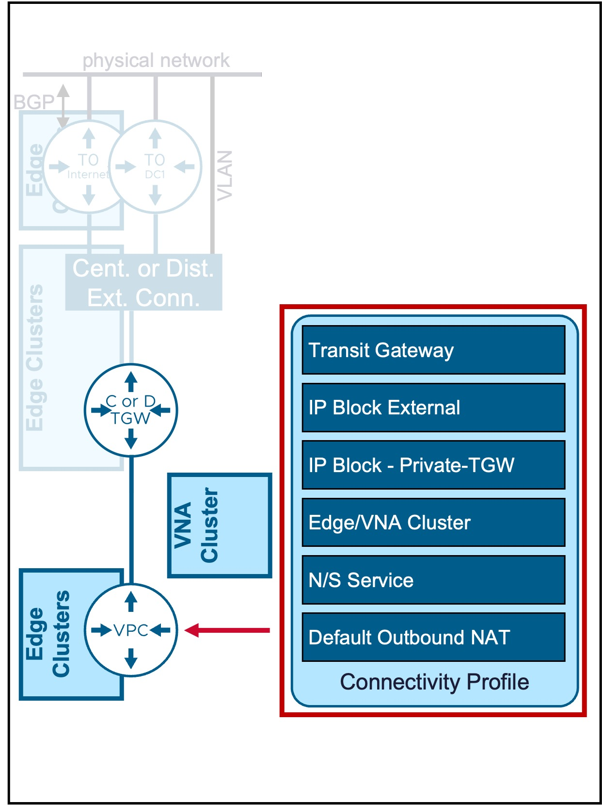
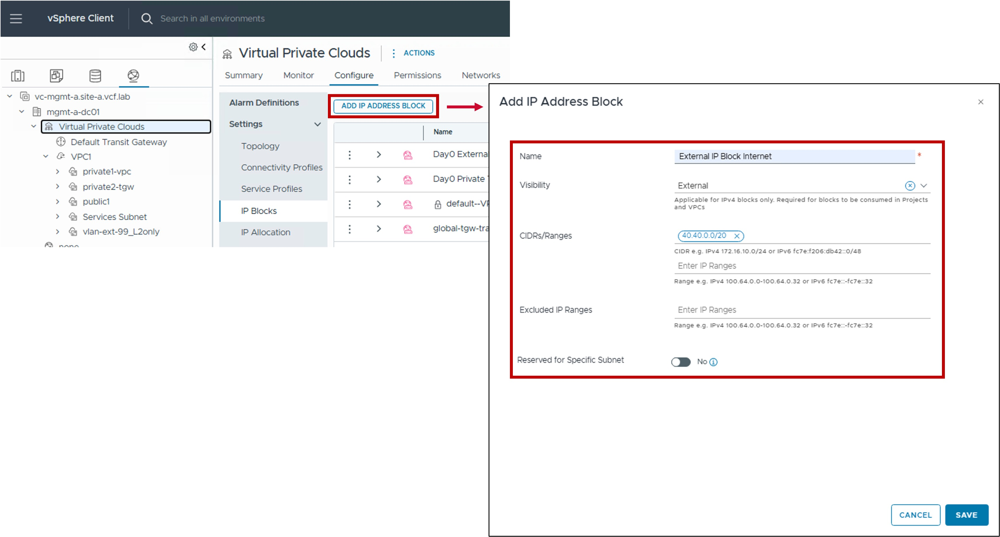
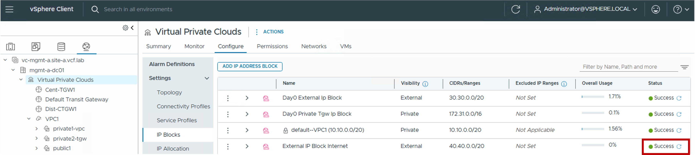

<h1>
   Connectivity Profile in vCenter
</h1>

This section describes the procedures for configuring  Connectivity Profile using the vSphere Client.  

{ width="100%" }

---

## 1. Configuration Network Span

### 1. Create Network Span
{ width="100%" style="display: block; margin: 0 auto;" }

* **Visibility**:  
  Set to External.

* **CIDRs/Ranges**:  
  Enter the specific CIDR blocks or IP ranges to be managed by this block.
  
* **Excluded IP Ranges**:  
  (Optional) Specify any IP Range(s) within the CIDRs above that should be withheld from automatic allocation (e.g. IP Range used by the physical network).
  
* **Reserved for Specific Subnet**:  
  Enable for the Subnet-VLAN use case, otherwise disabled.

### 2. Result - Network Span Status
The status reflects the successful application of the configuration.

!!! info "Note"
    Because this represents a logical configuration mapping rather than an active link-state protocol, the status will typically remain Green (Healthy) once the settings are validated by the NSX Manager.

{ width="80%" style="display: block; margin: 0 auto;" }

---
