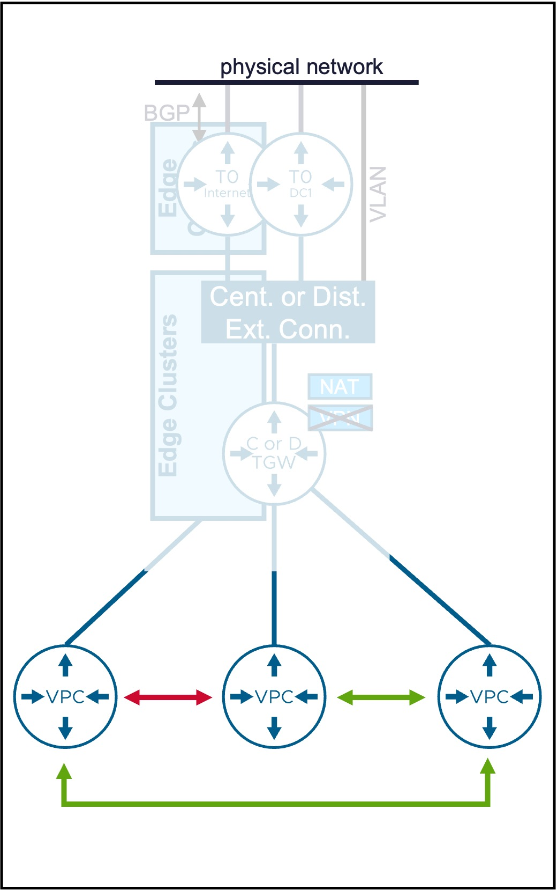
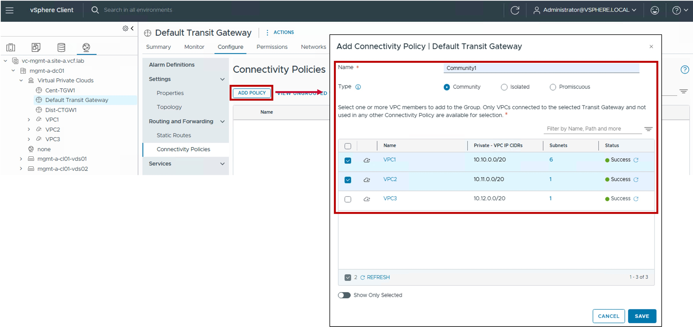
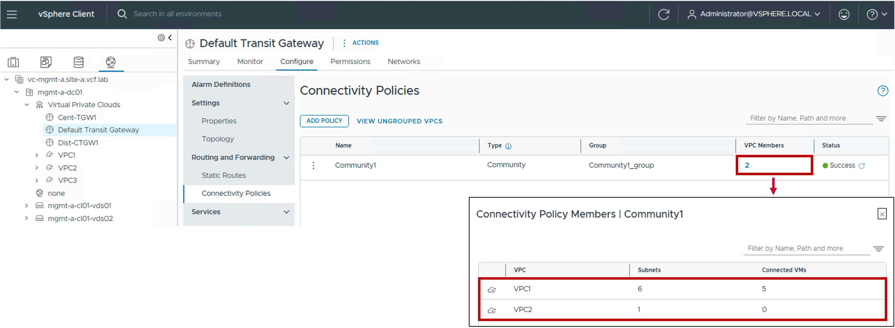

<h1>
   Connectivity Policy in vCenter
</h1>

This section describes the procedures for configuring Connectivity Policy using the vSphere Client.  

{ width="100%" }

---

## Overview of Connectivity Policy Types

| Type | Use Case | Routing Logic |
| :--- | :--- | :--- |
| [**Community**](#community) | Permits communication between VPCs within the same defined group. Ideal for application-tier connectivity within a specific division. | VPCs can communicate with other **Community** peers in their group and all **Promiscuous** VPCs. |
| [**Isolated**](#isolated)| Strictly blocks communication to all other VPCs. Best for highly sensitive or standalone application workloads. | VPCs are restricted to communicating only with **Promiscuous** VPCs (Shared Services). |
| [**Promiscuous**](#promiscuous)| Provides universal connectivity across the environment. Ideal for shared  services (e.g., Backup, DNS, NTP). | VPCs have unrestricted communication with **all** other VPCs in the environment. |

{: .center style="width:80%" }

---

## Connectivity Policy

### Configuration

#### Step1. Create Connectivity Policy
{ width="100%" style="display: block; margin: 0 auto;" }

* **Visibility**:  
  Set to External.

* **CIDRs/Ranges**:  
  Enter the specific CIDR blocks or IP ranges to be managed by this block.  

  
* **Excluded IP Ranges**:  
  (Optional) Specify any IP Range(s) within the CIDRs above that should be withheld from automatic allocation (e.g. IP Range used by the physical network).
  
* **Reserved for Specific Subnet**:  
  Enable for the Subnet-VLAN use case, otherwise disabled.

### Monitoring

#### Other VPCs with connectivity with yours

{ width="80%" style="display: block; margin: 0 auto;" }

#### VPCs who belong to no Community

{ width="80%" style="display: block; margin: 0 auto;" }

---
