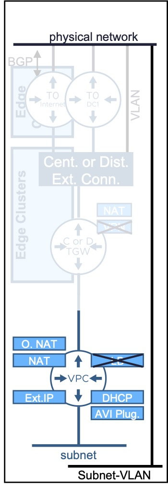
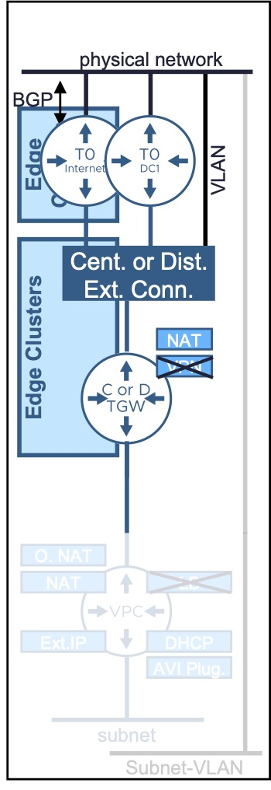

<h1>
  
  vCenter Network Services
</h1>

This section provides technical procedures for configuring and managing network services via the **vSphere Client**.  

---

## VPC Network Services
Explore the specific configuration guides for each VPC network service:

{ width="100%" }

* :material-router: [**VPC Router**](1a-vpc_router.md)  
  Logical router.
* :material-lan: [**VPC Subnet**](1b-vpc_subnet.md)  
  Logical Subnet (for VMs/K8s connection).  
  Option to also create Subnet-VLAN.
* :material-swap-horizontal: [**NAT**](1c-vpc_nat.md)  
  External-IP (1:1 NAT)  
  or Outbound-NAT (N:1 NAT)  
  or NAT (SNAT/DNAT)
* :material-ip-network-outline: [**DHCP**](1d-vpc_DHCP.md)  
  DHCP Server (managed by VCF)  
  or DHCP Relay (managed by 3rd party DHCP Server like Infoblox)
* :material-arrow-split-vertical: [**Load Balancer**]    
  VMware AVI Load Balancer.  
  Configuration not available from vCenter (available from AVI).
* :octicons-lock-16: [**VPN**]  
  Secure Site-to-Site connectivity.  
  Configuration not available from vCenter (available from NSX).

---

## North VPC Connectivity Configuration
Explore the specific configuration guides for each North VPC Connectivity Configuration:

{ width="100%" }

#### VCF Network Infrastructure
* :material-layers-outline: [__Edge Cluster / Edge Node__](2a-edge.md)  
  NSX Edge appliances providing centralized network services for Central Transit Gateway Designs.
* :material-layers-outline: [__VNA Cluster / VNA Node__](2b-vna.md)  
  NSX Virtual Network appliances providing centralized network services for Distributed Transit Gateway Designs.
* :material-router: [__Tier-0 / BGP__](2c-tier0.md)  
  Tier-0 logical router providing connectivity between Centralized Transit Gateways and the physical network.

#### VCF North Connectivity
* :fontawesome-solid-external-link: [__External Connection__](3a-external_connection.md)  
  Connection between the NSX environment and the physical network.
* :material-transit-connection: [__Transit Gateway__](3b-transit_gateway.md)  
  Logical router connecting VPC networks to external physical networks.
* :material-code-block-brackets: [__IP Blocks External (Infoblox) + TGW Priv.__](3c-ip_block.md)  
  IP blocks used for VPC subnet allocation.  
  Not represented in the diagram.
* :material-table-split-cell: [__Network Span__](3d-network_span.md)  
  Defines how VPC subnets span across vCenter clusters.  
  Not represented in the diagram.
* :material-camera-control: [__Community Policy__](3e-community_policy.md)  
  Defines cross-VPC communication options.  
  Not represented in the diagram.

---

!!! info "Document Versioning"
    This guide is updated for **VCF 9.1+**.  
    If you are running an older version, some options may not be available.

---