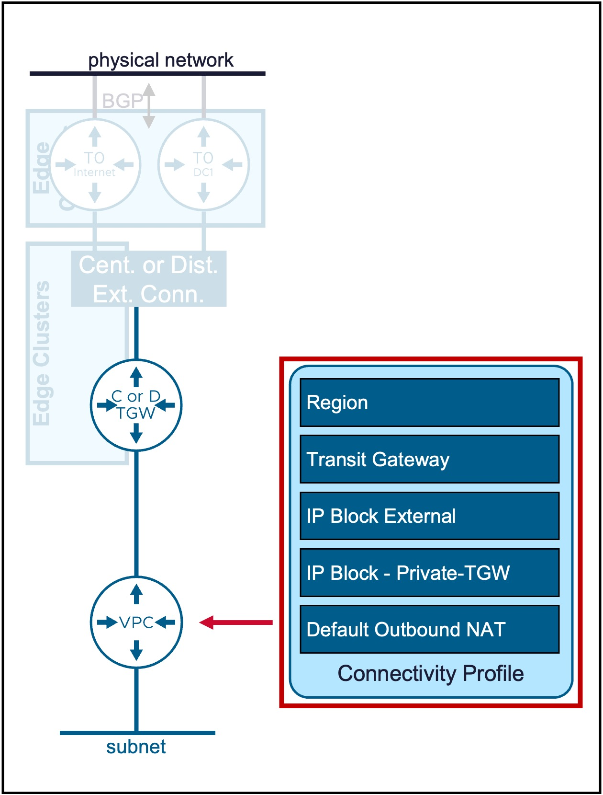
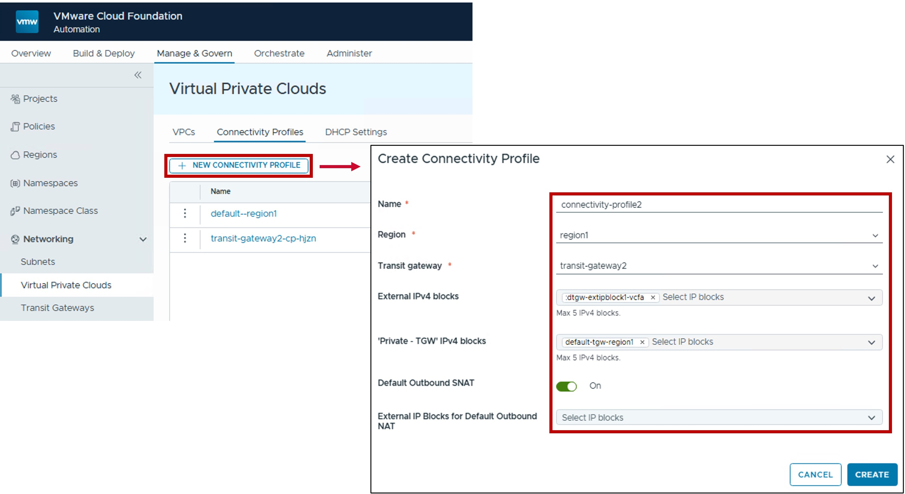
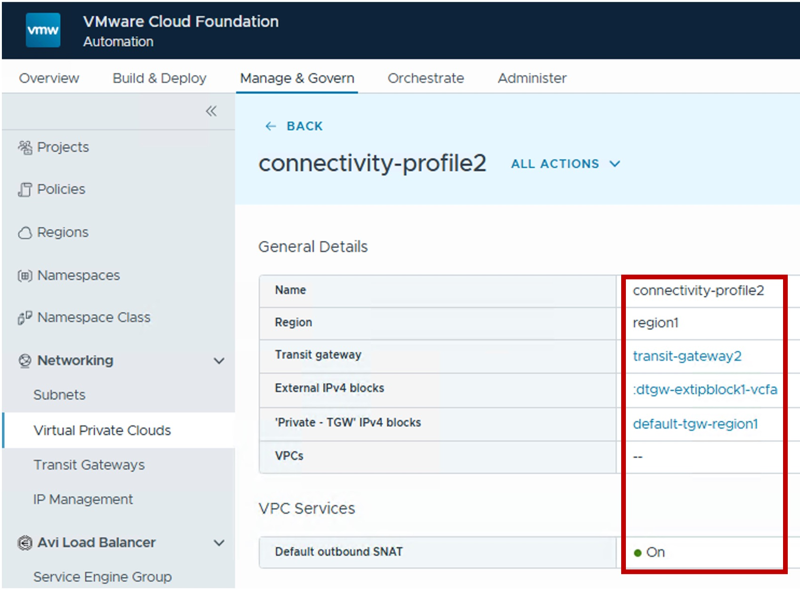

<h1>
   Connectivity Profile in VCF-A Tenant
</h1>

This section describes the procedures for configuring  Connectivity Profile by the VCF-A Tenant.
  
**Connectivity Profile** defines the VPC's connection to the Transit Gateway, specifies the assigned External and Private-TGW IP blocks, and determines which VPC Services can be enabled.

{ width="100%" }

---

## Connectivity Profile

??? info "Default Connectivity Profile"
    Each new VCF-A Organization has a default Connectivity Profile created at the creation of the Organization by the VCF-A Provider.  
    The steps below are for the VCF-A Tenant to create another Connectivity Profile in its Organization.

### Configuration

#### Step1. Create Connectivity Profile
{ width="95%" style="display: block; margin: 0 auto;" }

* **Region**:  
  Select the Region for the Transit Gateway.  
  Note: Region represents the vCenter Supervisor(s) associated with a specific NSX instance.

* **Transit Gateway**:  
  Select the Centralized or Distributed Transit Gateway, VPC Gateways will be connected to.

* **External IP Blocks**:  
  Select the [External IP Block(s)](4c-ip_block_provider.md#ext-ipblock) for future VPC Subnets Public, NAT, LB VIP, and VPN.

* **'Private - TGW' IPv4 blocks**:  
  Select the [Private IP Block(s)](1d-ip_block_tenant.md#privatetgw-ipblock) for future VPC Subnets Private-TGW.
 
* **Default Outbound SNAT**:  
  Enable to allow [Default Outbound SNAT](2d-vpc_nat.md#outbound-snat) on VPC Gateways.  
  Note: Requires to select a Centralized Transit Gateway or Distributed Transit Gateway + VNA.

* **External IP Block for Default Outbound NAT**:  
  (Optional) Select a specif External IP Block to use for Outbound NAT.  
  If not selected, it will pick an IP from the External IP Blocks list configured above.

### Monitoring

#### Status
The status reflects the successful application of the configuration.

??? info "Note about the Status"
    Because this represents a logical configuration mapping rather than an active link-state protocol, the status will typically remain Green (Healthy) once the settings are validated by the NSX Manager.

{ width="60%" style="display: block; margin: 0 auto;" }

---
