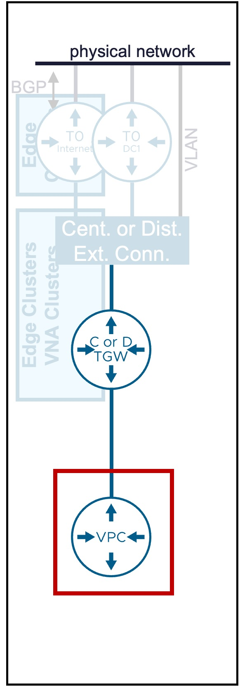
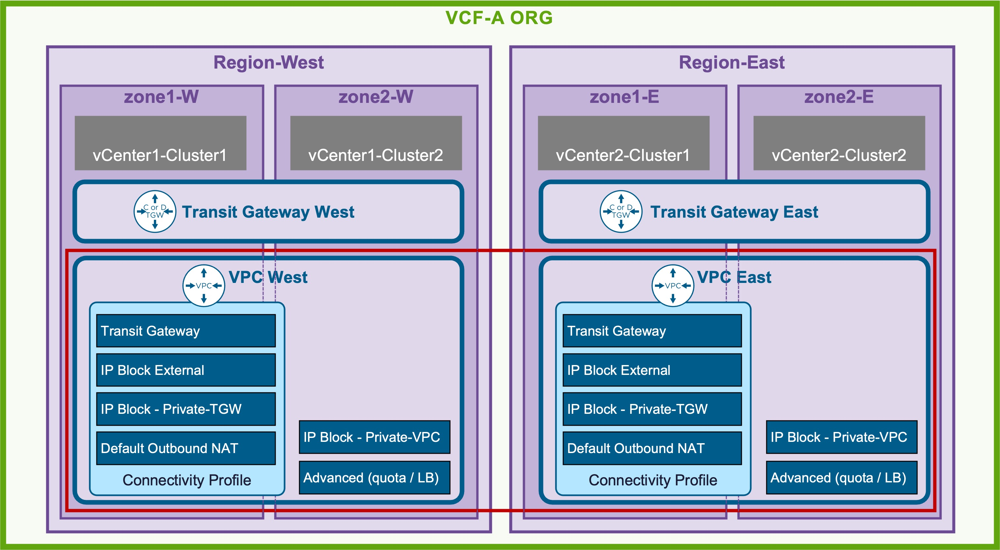
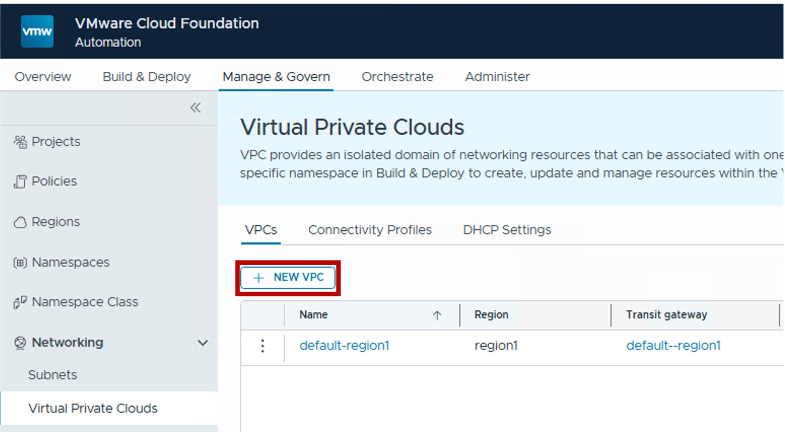
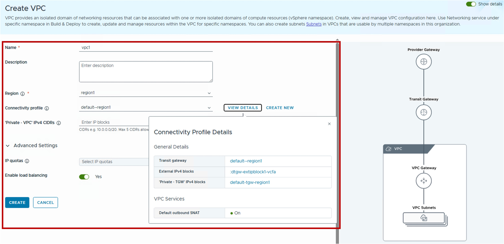

<h1>
   VPC Gateway Configuration in VCF-A Tenant
</h1>

This section describes the procedures for configuring a VPC Gateway using the VCF-A Tenant.
  
**VPC Gateway** is the logical router for VPC networking.

{ width="100%" }

---

## VPC Gateway

**VPC Gateways** are always scoped within a VCF Automation Region.

{ width="90%" style="display: block; margin: 0 auto;" }

??? info "VPC Automation Regions and Zones"
    In VCF Automation, the infrastructure is mapped as follows:

      * **Regions**: Represent the vCenter Supervisor(s) associated with a specific NSX instance.
      * **Zones**: Represent the vCenter Cluster(s) associated with a specific vCenter Supervisor.

### Configuration

??? info "Default VPC Gateway"
    Each new VCF-A Organization has a default VPC.  
    The steps below are for the VCF-A Tenant to create another VPC Gateway in its Organization.

#### Step1. Create new VPC Gateway
{ width="50%" style="display: block; margin: 0 auto;" }

#### Step2. Configure new VPC Gateway
{ width="80%" style="display: block; margin: 0 auto;" }

* **Region**  
  Select the Region for the VPC.  
  Note: Region represents the vCenter Supervisor(s) associated with a specific NSX instance.

* **Connectivity Profile**  
  Select the pre-defined [Connectivity Profile](1b-connectivity_profile.md).  
  This profile links the VPC to:  
  . [Transit Gateway](1a-transit_gateway.md) - determines the primary North-South path to the physical network  
  . [External IP Blocks](4c-ip_block.md) and ['Private -TGW' IP Blocks](4c-ip_block.md) - determines the future IP addressing of the VPC subnets / NAT / LB  
  . [Default Outbound SNAT](2c-vpc_nat.md) - determines if compute (VMs / VKS) connected to Private VPC subnets will be SNATed by default to access external networks.
  
* **'Private - VPC' IPv4 CIDRs**  
  (Optional) Defines the IP address space reserved for internal VPC subnets.  
  Address selection here is highly flexible; since all traffic from Private VPC subnets is **Source NATed (SNATed)** using a Public/External IP before exiting the VPC, these internal addresses can not conflict with your existing physical network infrastructure.

* **IP quotas**  
  (Optional) Select an IP Quota to limit the total number of public IP addresses that can be allocated within this VPC.

* **Enable load balancing**  
  Toggle whether the Load Balancing service is available for this VPC.  
  Note: Requires a Connectivity Profile associated with a Centralized Transit Gateway or a Distributed Transit Gateway with VNA.

!!! warning "Requirements for vSphere Kubernetes Service (VKS)"

    * Private - VPC: configured with at least 1 IP Block
    * Default Outbound SNAT: On
    * Load Balancing: Enabled

### Monitoring

{ width="90%" style="display: block; margin: 0 auto;" }

#### Status
View the operational state and health status of the VPC Gateway at a glance.

#### IP Block Usage
Monitor the consumption of the IP Blocks (External, Private-TGW, and Private-VPC).

* External & Private-TGW: Displays aggregate usage across this VPC and all other VPCs sharing these global resource pools
* Private-VPC: Displays the local usage of CIDR ranges reserved exclusively for this VPC

#### IP Quota Usage
Track the specific consumption of External IP addresses by this VPC against its assigned IP Quota.

---
