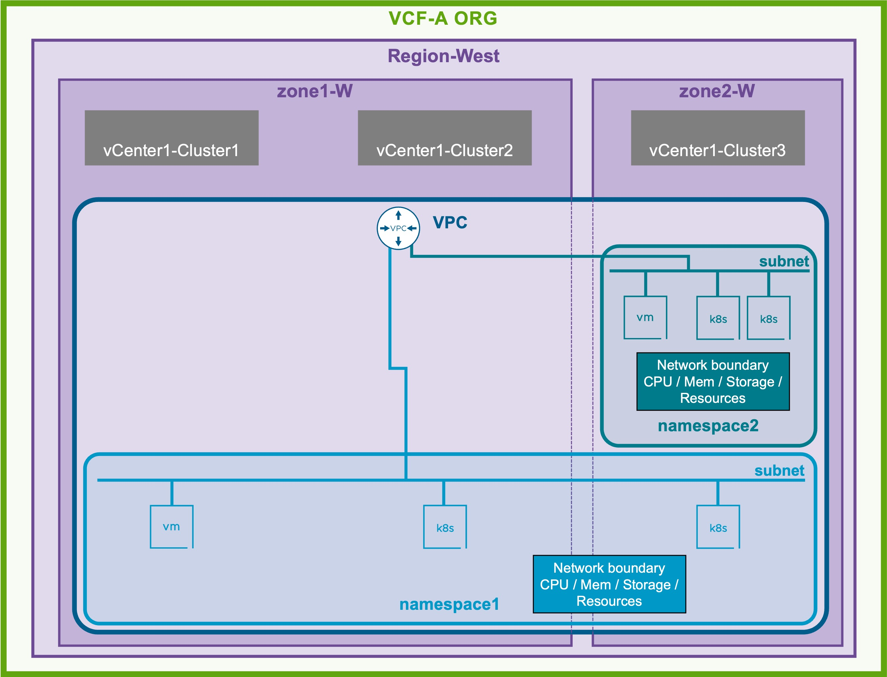

<h1>
   VCF-A Namespace in VCF-A Tenant
</h1>

This section describes the procedures for configuring a VCF-A Namespace by the VCF-A Tenant.

{ width="100%" }

---

## VCF-A Namespaces

Workloads (VMs and Kubernetes Clusters) are deployed in **VCF-A Namespaces**.  
Each VCF-A Namespace has:
* **Scope**: associated with specific **Zones** within a **Region** and linked to a VPC
* **Resource Control**: boundaries for CPU, memory, storage, and network resources for their workloads

{: .center style="width:80%" }

**VPC Subnet Placement**
VPC Subnets can be provisioned at two different levels depending on the desired scope:

* VCF-A Namespace Level: for dedicated VCF-A Namespace VPC-Subnets
* VPC Gateway Level: for shared VPC-Subnets cross VCF-A Namespaces

**VPC Subnets** can be created in:

* **VCF-A namespaces** (which is associated to a VPC)
* **VPC Gateway**

---

